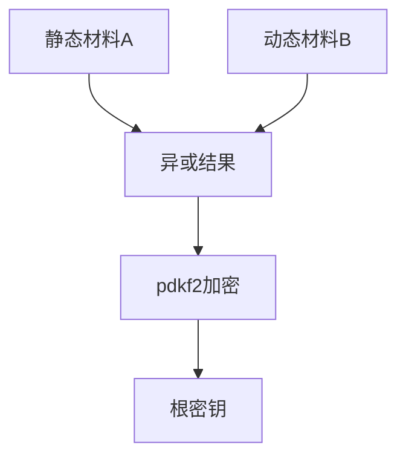
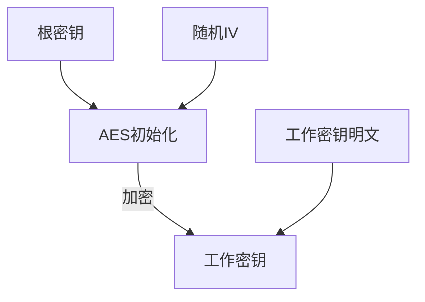
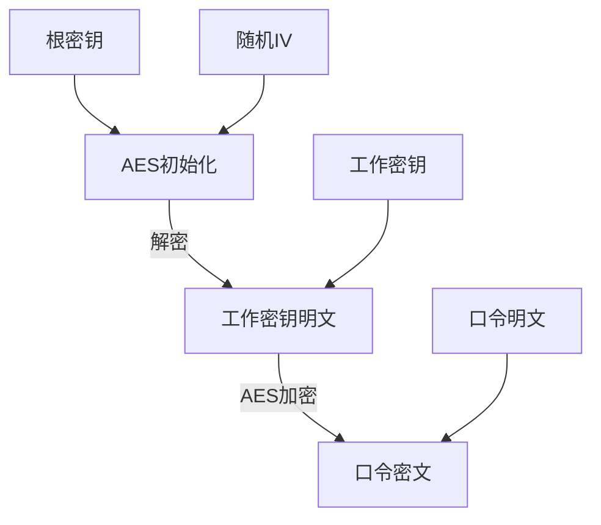
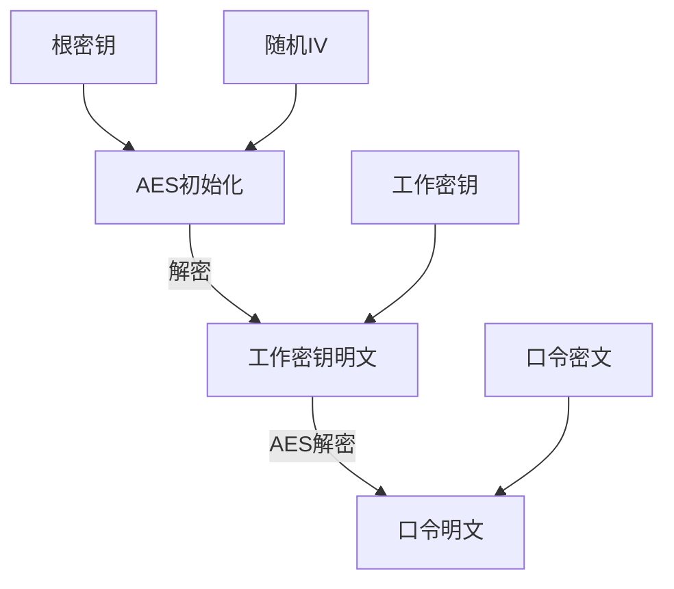

# 加密模块
- 配置文件信息加密解决方案

## 前置准备
### 根密钥(私有密钥)

```mermaid
graph TD;
    A[静态材料A]
    B[动态材料B]
    C[异或结果]
    D[pdkf2加密]
    E[根密钥]
    
    A-->C;
    B-->C;
    C-->D;
    D-->E
```

### 工作密钥(公有密钥)

```mermaid
graph TD;
    A[根密钥]
    B[随机IV]
    C[AES初始化]
    D[工作密钥明文]
    E[工作密钥]
    
    A-->C;
    B-->C;
    C--加密-->E;
    D-->E
```

## 加密

```mermaid
graph TD;
    A[根密钥]
    B[随机IV]
    C[AES初始化]
    D[工作密钥]
    E[工作密钥明文]
    F[口令明文]
    G[口令密文]
    
    A-->C;
    B-->C;
    C--解密-->E;
    D-->E
    E--AES加密-->G
    F-->G
```

## 解密

```mermaid
graph TD;
    A[根密钥]
    B[随机IV]
    C[AES初始化]
    D[工作密钥]
    E[工作密钥明文]
    F[口令明文]
    G[口令密文]
    
    A-->C;
    B-->C;
    C--解密-->E;
    D-->E
    E--AES解密-->F
    G-->F
```